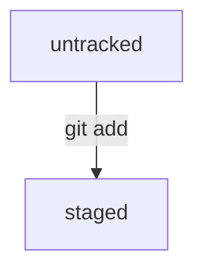

# Шпаргалка по GIT

## Установка GIT  

### Windows 

Если вы пользователь Windows, то Git у вас уже есть. Вы установили его в составе пакета Git for Windows вместе с командной строкой.

Убедитесь в этом. Откройте консоль и выполните эту команду.

**BASH**  

```bash
$ git version 
```
Если Git установлен правильно, консоль выведет его текущую версию.  

Для установки Git на macOS существует два способа.  
**Первый способ**. Откройте консоль и выполните команду ```/usr/bin/git```. Она запустит установщик. Нажмите **Install** (англ. «установить») и дождитесь окончания установки.  


Когда установка завершится, для проверки выполните эту команду.  

**BASH**  

```bash
$ git version 
```
Если на экран выводится текущая версия Git, значит, установка прошла успешно.

**Второй способ**. Используйте **Homebrew**.


1. Установите менеджер пакетов Homebrew:  
- Перейдите на [официальный сайт Homebrew](https://brew.sh).
- Скопируйте команду для установки — справа от неё есть символ для копирования. Нажмите на него, чтобы команда попала в буфер обмена.


- Найдите программу Terminal в поиске Spotlight или в списке программ. Вставьте скопированный текст в окно терминала и нажмите ```Enter```.
2. Установите Git с помощью Homebrew. Скопируйте и введите в терминал следующую команду.

**BASH**

```Bash
$ brew install git
```

3. Проверьте установку. Для этого откройте терминал и введите эту команду.

**BASH**
```bash
$ git version
```
Если на экран выводится текущая версия Git, значит, установка прошла успешно. 


## Настройка GIT  

Для настройки Git можно использовать командную строку — теперь вы умеете работать с ней. Если у вас macOS или Linux, запустите программу Terminal. Если Windows — Git Bash.

## Работа с файлом настройки ```.gitconfig```

Сейчас вы работаете в одиночку, но в дальнейшем вам может понадобиться использовать Git в команде.  
Чтобы участникам проекта было понятно, кто и какие изменения вносил, нужно представиться и указать. 
имя пользователя и адрес электронной почты.  

Вы можете указать любую электронную почту и любое имя. Сделать это можно с помощью команды ```git  
config``` (от англ. *configuration* — «конфигурация», «настройка») с ключом ```--global``` (англ. *«глобальный»*). При  
этом не имеет значения, в какой директории вы находитесь прямо сейчас: вызов ```git config --global```  
сработает везде.

В качестве значения ```user.name``` нужно указать своё имя или никнейм. Для настройки параметра ```user.email``` указывают электронную почту.

Все глобальные настройки Git хранит в файле ```.gitconfig``` в домашней директории. Команда запишет в этот файл  
указанные имя и почту. Чтобы убедиться в этом, можно вызвать команду для чтения файлов.  

**Bash**  
```bash
$ cat ~/.gitconfig
```
Другой способ проверки — вывести содержимое файла конфигурации Git той же командой ```git config``` с флагом  
```--list``` (англ. «список»).  

**Bash** 
```bash
$ git config --list
```  
В ответ командная строка покажет текущие значения настроек.  

**Bash**  
```bash
user.name=Username
user.email=username@yandex.ru
```    

## Хеш — идентификатор коммита  
В процессе работы с Git вам будет часто встречаться понятие «хеш коммита». Эти странные строчки с бессмысленным (на первый взгляд) набором букв и цифр вы могли видеть, когда вызывали команду ```git log``` и выводили историю коммитов.  

  
В этом уроке разберём, что такое хеши и зачем они нужны.  

## Что такое хеш. Хеширование коммитов. 
**Хеширование** (от англ. *hash*, «рубить», «крошить», «мешанина») — это способ преобразовать набор данных и получить их «отпечаток» (англ. *fingerprint*).  

Информация о коммите — это набор данных: когда был сделан коммит, содержимое файлов в репозитории на момент коммита и ссылка на предыдущий, или **родительский** (англ. *parent*), коммит.

Git хеширует (преобразует) информацию о коммите с помощью алгоритма **SHA-1** (от англ. Secure Hash Algorithm — «безопасный алгоритм хеширования») и получает для каждого коммита свой уникальный хеш — результат хеширования.

Обычно хеш — это короткая (40 символов в случае SHA-1) строка, которая состоит из цифр 0—9 и латинских букв A—F (неважно, заглавных или строчных). Она обладает следующими важными свойствами:
- если хеш получить дважды для одного и того же набора входных данных, то результат будет гарантированно одинаковый;
- если хоть что-то в исходных данных поменяется (хотя бы один символ), то хеш тоже изменится (причём сильно).  

Чтобы убедиться в этом, можно поэкспериментировать с SHA-1 на этом сайте — попробуйте ввести в поле input (англ. «ввод») разные символы, слова или предложения и понаблюдайте, как меняется хеш в поле output (англ. «вывод»).
## Хеш — основной идентификатор коммита  
Git хранит таблицу соответствий ```хеш → информация о коммите```. Если вы знаете хеш, вы можете узнать всё остальное: автора и дату коммита и содержимое закоммиченных файлов. Можно сказать, что хеш — основной идентификатор коммита.

При работе с Git хеши будут встречаться вам регулярно. Их можно будет передавать в качестве параметра разным Git-командам, чтобы указать, с каким коммитом нужно произвести то или иное действие.

Все хеши и таблицу ```хеш → информация о коммите``` Git сохраняет в служебные файлы. Они находятся в скрытой папке ```.git``` в репозитории проекта.
## Исследуем лог
В этом уроке рассмотрим подробнее, из каких элементов состоит описание коммита, а также как вывести сокращённый **лог** (от англ. *log* — «журнал [записей]»). Сокращённый лог полезен, если нужно быстро найти нужный коммит среди сотни других.
## Элементы описания коммита

После вызова ```git log``` появляется список коммитов.  


Разберём элементы, из которых состоит описание:

- строка из цифр и латинских букв после слова commit — это хеш коммита;
- **Author** — имя автора и его электронная почта;
- **Date** — дата и время создания коммита;
- в конце находится сообщение коммита.  

Исходный код самого Git тоже хранится в Git-репозитории (тут уместно вспомнить про курицу и яйцо). Вот так выглядит описание самого первого коммита в репозитории Git. Изучите его.
```bash
commit e83c5163316f89bfbde7d9ab23ca2e25604af290
Author: Linus Torvalds <torvalds@linux-foundation.org>
Date:   Thu Apr 7 15:13:13 2005 -0700

    Initial revision of "git", the information manager from hell 
```
## Получить сокращённый лог — ```git log --oneline```

Получить сокращённый лог можно с помощью команды ```git log``` с флагом ```--oneline``` (англ. «одной строкой»). В терминале появятся только первые несколько символов хеша каждого коммита и их комментарии.

Сокращённый лог полезен, если в репозитории уже много коммитов — например, сотни или тысячи. В этом случае можно быстро найти нужный по описанию.

Сокращённый хеш (то есть первые несколько символов полного) можно использовать точно так же, как и полный. Для этого команда ```git log --oneline``` автоматически подбирает такую длину сокращённых хешей, чтобы они были уникальными в пределах репозитория и Git всегда мог понять, о каком коммите идёт речь.

Обратите внимание: если выход из просмотра логов не произошёл автоматически, нажмите клавишу ```Q``` (от англ. *Quit* — «выйти») в английской раскладке клавиатуры.
Здорово! Самое важное в этом уроке:

- Можно вызвать не только полный лог, но и сокращённый — это делается командой ```git log --oneline```.
- В сокращённом логе выводятся сокращённые хеши — их можно использовать точно так же, как и полные.
## HEAD — всему голова

При вызове команды ```git log``` вы также могли заметить надпись ```(HEAD -> master)``` после хеша одного из коммитов. В этом уроке расскажем, что она означает.

## Файл ```HEAD```
Файл ```HEAD``` (англ. «голова», «головной») — один из служебных файлов папки ```.git```. Он указывает на коммит, который сделан последним (то есть на самый новый).

В этом можно убедиться с помощью терминала. Перейдите в папку ```.git``` командой ```cd```. Посмотрите содержимое файла ```HEAD``` командой ```cat```.  

**Bash**  
```bash
$ pwd # посмотрели, где мы
/Users/user/dev/first-project

$ cd .git/
$ ls # посмотрели, какие есть файлы
COMMIT_EDITMSG  ORIG_HEAD  description  index  logs/     refs/
HEAD            config     hooks/       info/  objects/

$ cat HEAD # команда cat показывает содержимое файла
ref: refs/heads/master # в файле вот такая ссылка 
```
Внутри ```HEAD``` — ссылка на служебный файл: ```refs/heads/master``` (или ```refs/heads/main``` в зависимости от названия ветки). Если заглянуть в этот файл, можно увидеть хеш последнего коммита.

**BASH**

Когда вы делаете коммит, Git обновляет ```refs/heads/master``` — записывает в него хеш последнего коммита. Получается, что ```HEAD``` тоже обновляется, так как ссылается на ```refs/heads/master```.

При работе с Git указатель ```HEAD``` используется довольно часто. Мы уже упоминали, что многие команды Git принимают в качестве параметра хеш коммита. Если нужно передать последний коммит, то вместо его хеша можно просто написать слово ```HEAD``` — Git поймёт, что вы имели в виду последний коммит.
## Статусы файлов в Git
Такое поведение интуитивно более понятно. Зато Git даёт больше контроля за состоянием файлов. Хотя сначала это может показаться сложным, со временем вы оцените удобство более явного подхода.

В этом уроке разберём подробнее, в каких состояниях (или статусах) могут находиться файлы в репозитории. А ещё проследим типичный жизненный цикл файла в Git.


### Статусы ```untracked```/```tracked```, ```staged``` и ```modified```

Одна из ключевых задач Git — отслеживать изменения файлов в репозитории. Для этого каждый файл помечается каким-либо статусом. Рассмотрим основные.

- ```untracked``` (англ. «неотслеживаемый») 
   Мы говорили, что новые файлы в Git-репозитории помечаются как ```untracked```, то есть неотслеживаемые. Git «видит», что такой файл существует, но не следит за изменениями в нём. У ```untracked```-файла нет предыдущих версий, зафиксированных в коммитах или через команду ```git add```. 
- ```staged``` (англ. «подготовленный»)  

  
После выполнения команды ```git add``` файл попадает в **staging area** (от англ. *stage* — «сцена», «этап [процесса]» и *area* — «область»), то есть в список файлов, которые войдут в коммит. В этот момент файл находится в состоянии ```staged```.
  
В одном из предыдущих уроков мы сравнили коммит с фотографией. Можно развить эту аналогию и сказать, что команда ```git add``` добавляет персонажей (текущее содержимое файла или нескольких файлов) на **сцену** (англ. *stage*) для общей фотографии, а ```git commit``` делает снимок всей сцены целиком. 
  
  **Staging area, index и cache**  
  
  Staging area также называют **index** (англ. «каталог») или **cache** (англ. «кеш»), а состояние файла ```staged``` иногда называют ```indexed``` или ```cached```.
  
  Все три варианта могут встречаться в документации и в качестве флагов команд Git. А также в интернете — например, в вопросах и ответах [на сайте Stack Overflow](https://stackoverflow.com/).
- ```tracked``` (англ. «отслеживаемый»)  
   Состояние ```tracked``` — это противоположность ```untracked```. Оно довольно широкое по смыслу: в него попадают файлы, которые уже были зафиксированы с помощью ```git commit```, а также файлы, которые были добавлены в *staging area* командой ```git add```. То есть все файлы, в которых Git так или иначе отслеживает изменения. 
- ```modified``` (англ. «изменённый»)  
   Состояние ```modified``` означает, что Git сравнил содержимое файла с последней сохранённой версией и нашёл отличия. Например, файл был закоммичен и после этого изменён.  

Для файлов в состояниях ```staged``` и ```modified``` обычно не указывают, что они также ```tracked```, потому что это состояние подразумевается.
### Про ```staged``` и ```modified```

Команда ```git add``` добавляет в staging area только текущее содержимое файла. Если вы, например, сделаете ```git add file.txt```, а затем измените ```file.txt```, то новое содержимое файла не будет находиться в staging.

Git сообщит об этом с помощью статуса ```modified```: файл изменён относительно той версии, которая уже в staging. Чтобы добавить в staging последнюю версию, нужно выполнить ```git add file.txt``` ещё раз.
### Типичный жизненный цикл файла в Git
Может показаться, что файлы в репозитории попадают в разные состояния хаотично. На практике это не так, и у большинства файлов вполне предсказуемый путь.


